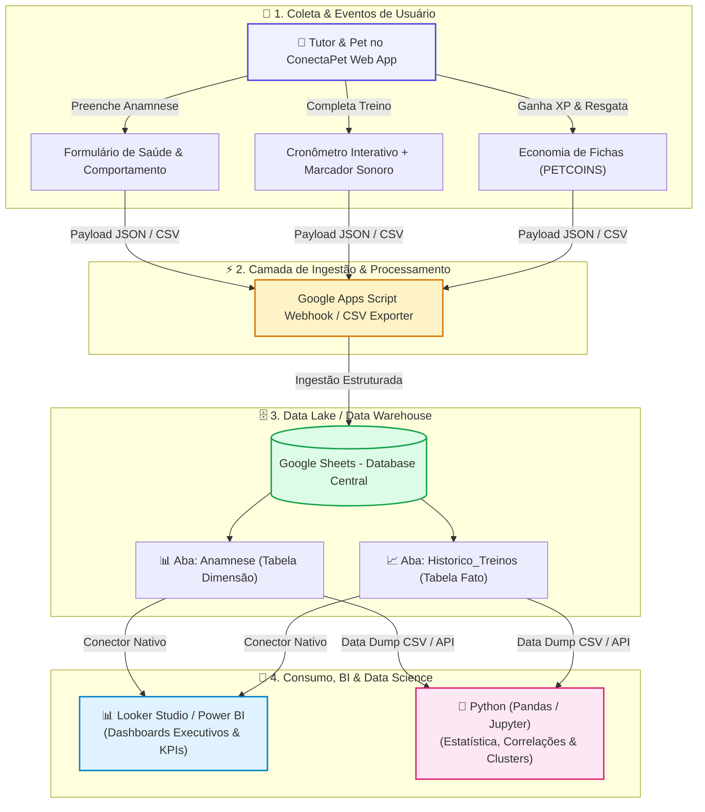

# 🐾 ConectaPet - Gamified Pet Training & Behavioral Analytics Platform

> **Plataforma web gamificada para adestramento positivo e saúde comportamental pet com pipeline de dados integrado para Google Sheets, Looker Studio e Python.**

---

## 🚀 Aplicação em Produção
- 📱 **App Web / PWA:** [https://conectapet-jornada-anamnese-pet.ai.studio](https://conectapet-jornada-anamnese-pet.ai.studio)
- 📊 **Dataset Analítico:** Exportação nativa em CSV e sincronização em tempo real via Google Apps Script.

---

## 📌 Sobre o Projeto

O **ConectaPet** foi desenvolvido para resolver o alto índice de estresse, frustração e abandono em rotinas de adestramento tradicional de cães e gatos. Utilizando a metodologia científica de **reforço positivo** e **micro-doses diárias de treino (3 a 15 minutos)**, a plataforma combina:

1. **Jornada Gamificada & Tabuleiro:** Fases progressivas de aprendizagem com rolagem de dados e avanço por metas comportamentais.
2. **Consultoria Comportamental Autônoma:** Diagnósticos e protocolos práticos para desafios comuns (Ansiedade por Separação, Reatividade na Guia, Posse de Recursos e Sinais de Calma).
3. **Cronômetro Guiado com Marcador Sonoro (Clicker):** Temporizador interativo com áudio sintetizado em baixa latência (Web Audio API) para condicionamento operante preciso.
4. **Economia de Fichas (PETCOINS):** Recompensas virtuais acumuladas a cada treino concluído e resgatáveis em vouchers e petiscos.
5. **Data Engine Integrado:** Coleta contínua de métricas transacionais de anamnese, tempo de sessão, taxa de sucesso e engajamento do tutor.

---

## 🏗️ Arquitetura do Pipeline de Dados
# 🐾 ConectaPet - Gamified Pet Training & Behavioral Analytics Platform

> **Plataforma web gamificada para adestramento positivo e saúde comportamental pet com pipeline de dados integrado para Google Sheets, Looker Studio e Python.**

---

## 🚀 Aplicação em Produção
- 📱 **App Web / PWA:** [https://conectapet-jornada-anamnese-pet.ai.studio](https://conectapet-jornada-anamnese-pet.ai.studio)
- 📊 **Dataset Analítico:** Exportação nativa em CSV e sincronização em tempo real via Google Apps Script.

---

## 📌 Sobre o Projeto

O **ConectaPet** foi desenvolvido para resolver o alto índice de estresse, frustração e abandono em rotinas de adestramento tradicional de cães e gatos. Utilizando a metodologia científica de **reforço positivo** e **micro-doses diárias de treino (3 a 15 minutos)**, a plataforma combina:

1. **Jornada Gamificada & Tabuleiro:** Fases progressivas de aprendizagem com rolagem de dados e avanço por metas comportamentais.
2. **Consultoria Comportamental Autônoma:** Diagnósticos e protocolos práticos para desafios comuns (Ansiedade por Separação, Reatividade na Guia, Posse de Recursos e Sinais de Calma).
3. **Cronômetro Guiado com Marcador Sonoro (Clicker):** Temporizador interativo com áudio sintetizado em baixa latência (Web Audio API) para condicionamento operante preciso.
4. **Economia de Fichas (PETCOINS):** Recompensas virtuais acumuladas a cada treino concluído e resgatáveis em vouchers e petiscos.
5. **Data Engine Integrado:** Coleta contínua de métricas transacionais de anamnese, tempo de sessão, taxa de sucesso e engajamento do tutor.

---

## 🏗️ Arquitetura do Pipeline de Dados
## 🏗️ Arquitetura do Pipeline de Dados

